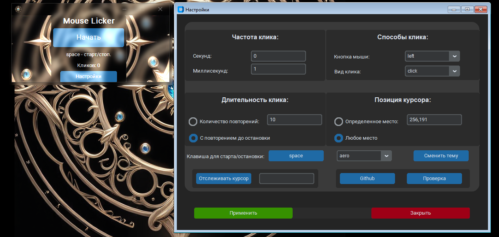

# Настраиваемый автокликер. Mouse Auto Licker.
<hr>

Этот скрипт представляет собой автоматический кликер мыши с настройками.\
Он позволяет настроить частоту и вид кликов, кнопку мыши, \
клавишу для старта/остановки, а также повторение кликов\
определенное количество раз или до остановки.




## Особенности

- **Частота клика**: настройте задержку между кликами.
- **Способы клика**: выберите тип клика (одиночный, двойной, тройной) и кнопку мыши (левая, правая, средняя).
- **Длительность клика**: определите, сколько раз кликнуть или кликать до остановки.
- **Позиция курсора**: укажите место для клика или любую позицию.
- **Клавиша для старта/остановки**: выберите клавишу для начала и остановки автоклика.

## Установка

До запуска скрипта вам необходимо установить используемые библиотеки. Установите необходимые, используя следующие команды:

```bash
    pip install requirements.txt
```

## Использование

1. Запустите скрипт `MouseAutoLicker.py`.
2. Наведите курсор на кнопку "Начать", чтобы начать автоматический клик.
3. Для остановки автоклика используйте клавишу, указанную в настройках, Или кнопку "Остановить".
4. Для настройки параметров автоклика нажмите кнопку "Настройки".


## Заметки

> Писалось для темной темы. Если нужно для светлой темы, то см. [settings.ini](settings.ini)

> Советую сделать исполняемый файл(например, [тык](https://github.com/brentvollebregt/auto-py-to-exe)) чтобы можно было работать с автозагрузкой


## Лицензия

Этот проект распространяется под лицензией MIT. Подробности смотрите в файле [LICENSE](LICENSE).
